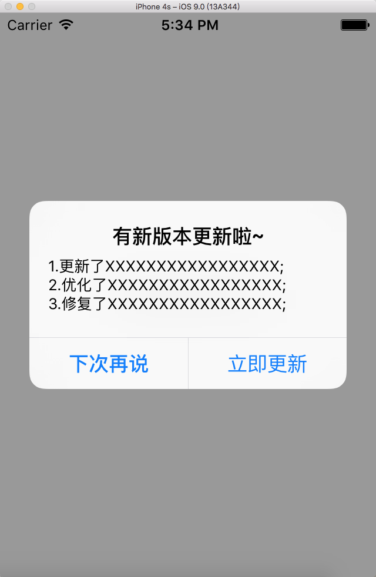

# MXUpdateAlert
版本更新提示

支持更新提示类型

- 0、强制更新
- 1、非强制更新仅提醒一次
- 2、非强制更新每次打开app都进行提醒
- 3、不显示更新

##使用
```
- (BOOL)application:(UIApplication *)application didFinishLaunchingWithOptions:(NSDictionary *)launchOptions {
    [[MXUpdateAlert sharedUpdateAlert] checkUpdate];
    return YES;
}
- (void)applicationDidBecomeActive:(UIApplication *)application {
    [[MXUpdateAlert sharedUpdateAlert] checkUpdate];
}
```
